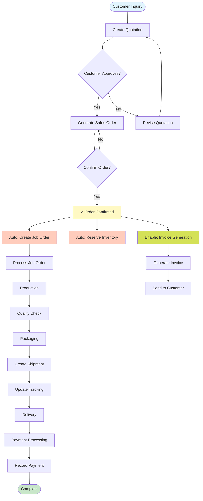

# Hibla Filipino Hair - Visual Process Flow

## 🎯 Core Business Process Flow



## 📱 System Navigation Map

```
Dashboard (Home)
│
├── 📋 Quotations
│   ├── View All Quotations
│   ├── Create New Quotation
│   ├── Actions per Quotation:
│   │   ├── Edit (same day only)
│   │   ├── Duplicate
│   │   ├── Generate Sales Order
│   │   ├── Export to Excel/PDF
│   │   └── Delete
│   └── Filters: Status, Date, Customer
│
├── 📦 Sales Orders
│   ├── View All Sales Orders
│   ├── Create from Quotation
│   ├── Actions per Order:
│   │   ├── View Details
│   │   ├── Confirm Order ⚡
│   │   ├── Generate Invoice
│   │   ├── Export to Excel/PDF
│   │   └── Create Revision
│   └── Filters: Status, Confirmed, Date
│
├── 🏭 Job Orders
│   ├── View All Job Orders
│   ├── Auto-created from Sales Orders
│   ├── Actions per Job:
│   │   ├── Update Status
│   │   ├── Track Production
│   │   ├── Create Shipment
│   │   └── Export PDF
│   └── Production Dashboard
│
├── 📊 Inventory
│   ├── Multi-Warehouse View
│   ├── Stock Levels
│   ├── Movement History
│   ├── AI Insights
│   └── Reorder Alerts
│
├── 👥 Customers
│   ├── Customer List
│   ├── Add New Customer
│   ├── Customer Details
│   ├── Order History
│   └── Credit Management
│
├── 💰 Price Management
│   ├── Product Pricing
│   ├── Tier Configuration
│   ├── Bulk Updates
│   └── Price Lists
│
└── 📈 Reports
    ├── Summary Reports
    ├── Sales Analytics
    ├── Export to Excel
    └── Custom Filters
```

## 🔄 Status Flow Transitions

### Quotation Status Flow
```
[Draft] → [Sent] → [Under Review] → [Approved/Rejected]
                                  ↓
                            [Converted to SO]
```

### Sales Order Status Flow
```
[Draft] → [Confirmed] → [In Production] → [Ready to Ship] → [Shipped] → [Delivered]
           ↓
     [Invoice Generated]
```

### Job Order Status Flow
```
[Pending] → [In Progress] → [Quality Check] → [Completed] → [Shipped]
```

### Invoice Status Flow
```
[Generated] → [Sent] → [Partial Payment] → [Paid] → [Closed]
```

## 🎨 Color-Coded Priority System

| Priority | Color | Use Case |
|----------|-------|----------|
| 🔴 Urgent | Red | Overdue orders, Critical alerts |
| 🟡 High | Yellow | Due this week, Pending confirmation |
| 🟢 Normal | Green | On schedule, Confirmed |
| 🔵 Low | Blue | Future orders, Drafts |
| ⚫ Complete | Gray | Delivered, Paid, Archived |

## 📊 Decision Points & Business Rules

### 1. Quotation Creation
```
Decision Tree:
├── Is customer registered?
│   ├── No → Register customer first
│   └── Yes → Continue
├── Check customer tier
│   ├── New Customer → Apply +15% markup
│   ├── Regular → Use base pricing
│   ├── Premier → Apply 15% discount
│   └── Custom → Use negotiated rates
└── Can be edited?
    ├── Same day → Allow edits
    └── Next day → Require duplication
```

### 2. Order Confirmation
```
Confirmation Checklist:
□ Payment terms verified
□ Inventory available
□ Production capacity checked
□ Shipping method confirmed
□ Customer instructions reviewed
↓
[Confirm] → Triggers:
• Job Order creation
• Inventory reservation
• Invoice enablement
• Email notifications
```

### 3. Production Planning
```
Job Order Processing:
├── Check inventory
│   ├── Available → Allocate
│   └── Not available → Create purchase order
├── Schedule production
│   ├── Regular → Standard timeline
│   └── Rush → Priority queue
└── Quality control
    ├── Pass → Ship
    └── Fail → Rework
```

## 🚀 Quick Action Shortcuts

### Daily Operations Checklist
```markdown
Morning (9:00 AM)
□ Check dashboard metrics
□ Review pending quotations
□ Process overnight orders
□ Check low inventory alerts

Midday (12:00 PM)
□ Update job order status
□ Confirm completed productions
□ Generate invoices for shipments
□ Send customer updates

Afternoon (3:00 PM)
□ Process new quotations
□ Review payment status
□ Update inventory movements
□ Plan tomorrow's production

End of Day (5:00 PM)
□ Export daily reports
□ Archive completed orders
□ Review KPIs
□ Set priorities for tomorrow
```

## 📱 Mobile-Optimized Workflows

### For Sales Team (Field)
1. **Quick Quote**: Customer → Products → Calculate → Send
2. **Order Status**: Search order → View status → Update customer
3. **Inventory Check**: Product → Stock levels → Availability

### For Warehouse Team
1. **Receive Stock**: Scan → Update quantity → Confirm location
2. **Pick Order**: Job order → Pick items → Mark ready
3. **Ship Order**: Pack → Generate docs → Update tracking

### For Management
1. **Dashboard View**: KPIs → Alerts → Pending approvals
2. **Quick Reports**: Select period → View summary → Export
3. **Approvals**: Review → Approve/Reject → Add notes

## 🔔 Automated Triggers & Notifications

| Event | Trigger | Action | Notification |
|-------|---------|--------|--------------|
| Quotation approved | Customer response | Enable SO generation | Sales team |
| Order confirmed | Confirmation button | Create job order | Production team |
| Low inventory | Below reorder point | Alert + Suggestion | Warehouse manager |
| Payment received | Finance update | Update invoice | Accounting |
| Shipment delayed | Tracking update | Alert | Customer service |
| Job completed | Status change | Enable shipping | Logistics |

## 📈 Performance Metrics Visualization

```
Dashboard KPIs Layout:
┌─────────────────┬─────────────────┬─────────────────┐
│   Quotations    │   Sales Orders  │   Job Orders    │
│   📊 52/month   │   📦 31/month   │   🏭 28/month   │
│   ↑ 15% growth  │   ↑ 8% growth   │   95% on-time   │
└─────────────────┴─────────────────┴─────────────────┘

┌─────────────────┬─────────────────┬─────────────────┐
│    Revenue      │    Inventory    │   Customers     │
│  💰 $125,000    │  📦 2,450 units │   👥 45 active  │
│   ↑ 12% MoM     │   85% accuracy  │   +5 new        │
└─────────────────┴─────────────────┴─────────────────┘
```

## 🎯 Success Path Examples

### Example 1: First-Time Customer Order
```
1. Customer emails inquiry
2. Add customer to system (5 min)
3. Create quotation with products (10 min)
4. Send quotation PDF via email (1 min)
5. Customer approves (1-3 days)
6. Generate sales order (2 min)
7. Confirm order (1 min)
8. Auto-created job order
9. Production completes (5-10 days)
10. Generate invoice (1 min)
11. Ship order (1 day)
12. Receive payment (7-30 days)
Total cycle: 15-45 days
```

### Example 2: Repeat Customer Rush Order
```
1. Regular customer calls for rush order
2. Create quotation with expedited shipping (5 min)
3. Immediate approval
4. Generate and confirm sales order (3 min)
5. Priority job order created
6. Fast-track production (2-3 days)
7. Express shipping (1-2 days)
8. Invoice with rush charges
Total cycle: 3-5 days
```

## 🛠️ Optimization Tips

### Speed Optimizations
- Use quotation templates for frequent orders
- Bulk update pricing during off-peak hours
- Pre-approve trusted customers for faster processing
- Keep commonly ordered items in stock

### Accuracy Improvements
- Double-check customer codes
- Verify specifications before confirmation
- Use barcode scanning for inventory
- Implement approval workflows for large orders

### Customer Satisfaction
- Send automatic status updates
- Provide tracking information proactively
- Maintain buffer stock for key products
- Offer multiple payment options

---

*This visual guide provides a complete overview of the Hibla Filipino Hair business process flow, from initial customer contact through to successful delivery and payment.*